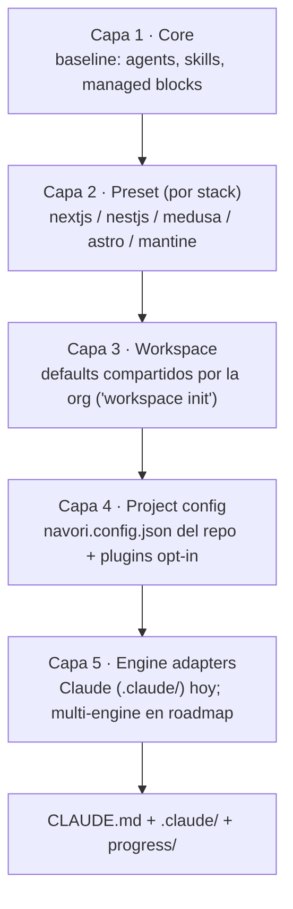
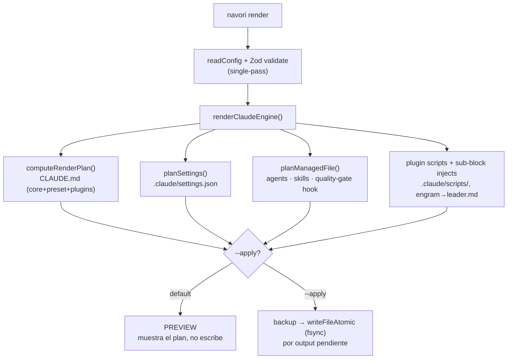
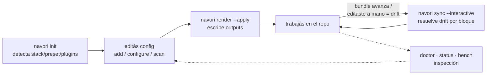

# Arquitectura de navori — cómo funciona (v0.2)

> Diagramas navegables: en GitHub, **hacé click en los nodos** para saltar al
> archivo fuente. navori reconstruye `CLAUDE.md` + `.claude/` de forma
> idempotente desde una única fuente de verdad (`navori.config.json`), sin
> pisar tu trabajo manual.

## 1. Modelo de capas — de dónde sale el contenido

Las 5 capas en cascada (decisión de diseño del proyecto): cada una compone
sobre la anterior. `navori.config.json` es la fuente de verdad checked-in y
materializa la **capa 4 (Project config)**: declara qué preset usar, de qué
workspace heredar y qué **plugins** habilitar. Los plugins son addons opt-in
*dentro* del Project config — no una capa aparte. La capa 5 (Engine adapters)
renderiza todo; hoy solo Claude Code, aunque el core es engine-agnostic por
diseño. (En monorepos, `monorepo.workspaces[]` aplica un override por app
dentro de la capa Project.)



> Los **plugins** (engram / gh / jscpd / semgrep / acli / cognitive) se declaran
> en la capa Project config y el render los aplica junto a core + preset — ver
> el pipeline abajo. [packages/plugins/](../packages/plugins)

## 2. Pipeline de render — `navori render [--apply]`

`render` es **preview por default** (no toca disco); `--apply` escribe. La
escritura es atómica y con backup previo. `NAVORI_BENCH=1` instrumenta los
tiempos por step.



## 3. Lifecycle de comandos — cómo lo usás



## 4. El corazón: bloques managed

Todo el modelo gira alrededor de marcadores en los archivos generados. La
regeneración es idempotente y nunca pisa lo que está fuera de los markers.

```text
<!-- navori:managed id="idioma-rol" hash="a1b2c3" version="0.0.1" source="@navori/core" -->
## Idioma y rol
- Código inglés. Chat español MX.            <- zona MANAGED (navori la regenera)
<!-- /navori:managed id="idioma-rol" -->

## Mis notas del proyecto                      <- zona USUARIO (navori nunca toca)
- lo que escribas acá sobrevive a todo render
```

- **`hash`** → detecta edición manual del bloque (content drift). `sync` lo
  respeta o lo resuelve interactivo (keep-mine / accept-new).
- **`version`** → detecta que el bundle (core/preset/plugin) avanzó (version
  drift). `render --apply` lo actualiza.
- **Fuera de los markers** → tuyo, intocable. Ese es el moat: regeneración
  idempotente sin destruir tu trabajo. Ver [marker.ts](../packages/cli/src/lib/marker.ts).

## Archivos clave

| Pieza | Archivo |
|---|---|
| Config + schema (Zod) | [lib/schema.ts](../packages/cli/src/lib/schema.ts) · [lib/config.ts](../packages/cli/src/lib/config.ts) |
| Plan de render (CLAUDE.md) | [lib/render-plan.ts](../packages/cli/src/lib/render-plan.ts) |
| Markers managed (inject/diff/hash) | [lib/marker.ts](../packages/cli/src/lib/marker.ts) |
| Engine Claude | [engines/claude/index.ts](../packages/cli/src/engines/claude/index.ts) |
| Settings deep-merge | [engines/claude/build-settings.ts](../packages/cli/src/engines/claude/build-settings.ts) |
| Render de agents/skills/hooks | [engines/claude/render-managed-file.ts](../packages/cli/src/engines/claude/render-managed-file.ts) |
| Presets / Plugins | [lib/presets.ts](../packages/cli/src/lib/presets.ts) · [lib/plugins.ts](../packages/cli/src/lib/plugins.ts) |
| Health-check (doctor/status) | [lib/health.ts](../packages/cli/src/lib/health.ts) |
| Detección de stack | [lib/detect.ts](../packages/cli/src/lib/detect.ts) |
| Comandos | [src/commands/](../packages/cli/src/commands) |
| Assets bundleados | [core-assets/](../packages/core/core-assets) · [plugins/](../packages/plugins) |

> El plan de release que produjo v0.2 está en
> [specs/0003-v0.2-quality-velocity-tokens.md](../specs/0003-v0.2-quality-velocity-tokens.md).
