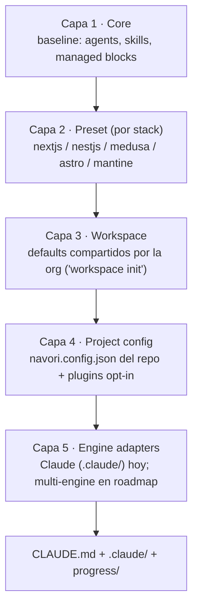
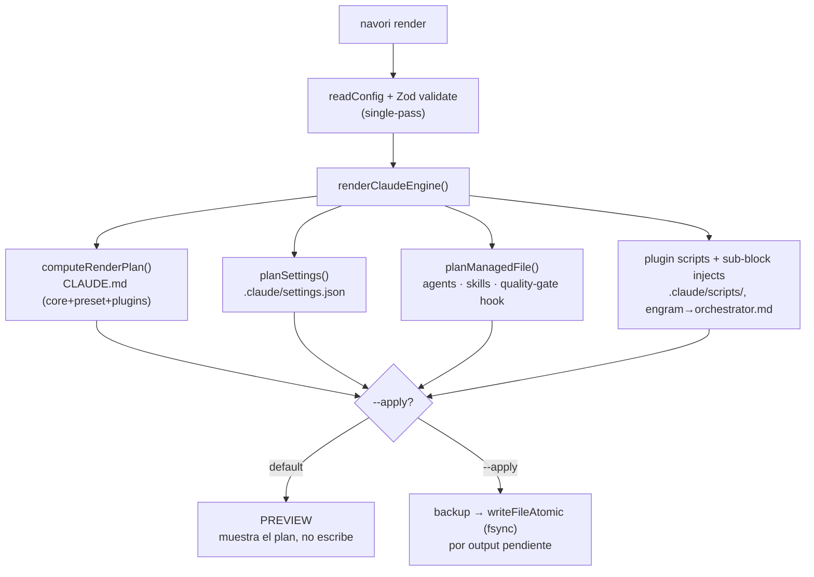
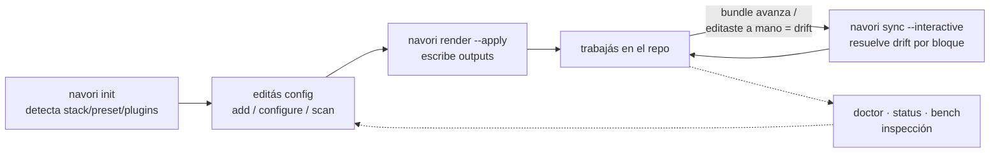

# Arquitectura de navori — cómo funciona (v0.2)

> Diagramas navegables: en GitHub, **hacé click en los nodos** para saltar al
> archivo fuente. navori reconstruye `CLAUDE.md` + `.claude/` de forma
> idempotente desde una única fuente de verdad (`navori.config.json`), sin
> pisar tu trabajo manual.

## 1. Modelo de capas — de dónde sale el contenido

Las 5 capas en cascada (decisión de diseño del proyecto): cada una compone
sobre la anterior. `navori.config.json` es la fuente de verdad checked-in y
materializa la **capa 4 (Project config)**: declara qué preset usar, de qué
workspace heredar y qué **plugins** habilitar. Los plugins son addons opt-in
*dentro* del Project config — no una capa aparte. La capa 5 (Engine adapters)
renderiza todo; hoy solo Claude Code, aunque el core es engine-agnostic por
diseño. (En monorepos, `monorepo.workspaces[]` aplica un override por app
dentro de la capa Project.)


```mermaid
flowchart TD
    CORE["Capa 1 · Core<br/>baseline: agents, skills, managed blocks"]
    PRESET["Capa 2 · Preset (por stack)<br/>nextjs / nestjs / medusa / astro / mantine"]
    WS["Capa 3 · Workspace<br/>defaults compartidos por la org ('workspace init')"]
    PROJ["Capa 4 · Project config<br/>navori.config.json del repo + plugins opt-in"]
    ENGINE["Capa 5 · Engine adapters<br/>Claude (.claude/) hoy; multi-engine en roadmap"]
    OUT["CLAUDE.md + .claude/ + progress/"]

    CORE --> PRESET --> WS --> PROJ --> ENGINE --> OUT

    click CORE "../packages/core/core-assets" "Core assets"
    click PRESET "../packages/core/core-assets/presets" "Presets"
    click WS "../packages/cli/src/lib/workspace/workspace.ts" "Workspace defaults"
    click PROJ "../packages/cli/src/lib/config/schema.ts" "Config schema (Zod)"
    click ENGINE "../packages/cli/src/engines/claude/index.ts" "Claude engine"
```

> Los **plugins** (engram / gh / jscpd / semgrep / acli / cognitive) se declaran
> en la capa Project config y el render los aplica junto a core + preset — ver
> el pipeline abajo. [packages/plugins/](../packages/plugins)

## 2. Pipeline de render — `navori render [--apply]`

`render` es **preview por default** (no toca disco); `--apply` escribe. La
escritura es atómica y con backup previo. `NAVORI_BENCH=1` instrumenta los
tiempos por step.


```mermaid
flowchart TD
    CMD["navori render"]
    READ["readConfig + Zod validate<br/>(single-pass)"]
    ENG["renderClaudeEngine()"]
    P1["computeRenderPlan()<br/>CLAUDE.md (core+preset+plugins)"]
    P2["planSettings()<br/>.claude/settings.json"]
    P3["planManagedFile()<br/>agents · skills · quality-gate hook"]
    P4["plugin scripts + sub-block injects<br/>.claude/scripts/, engram→orchestrator.md"]
    GATE{"--apply?"}
    PREVIEW["PREVIEW<br/>muestra el plan, no escribe"]
    WRITE["backup → writeFileAtomic (fsync)<br/>por output pendiente"]

    CMD --> READ --> ENG
    ENG --> P1
    ENG --> P2
    ENG --> P3
    ENG --> P4
    P1 --> GATE
    P2 --> GATE
    P3 --> GATE
    P4 --> GATE
    GATE -- "default" --> PREVIEW
    GATE -- "--apply" --> WRITE

    click CMD "../packages/cli/src/commands/render.ts" "render command"
    click READ "../packages/cli/src/lib/config/config.ts" "readConfig"
    click ENG "../packages/cli/src/engines/claude/index.ts" "Claude engine"
    click P1 "../packages/cli/src/lib/render/render-plan.ts" "computeRenderPlan"
    click P2 "../packages/cli/src/engines/claude/build-settings.ts" "buildClaudeSettings"
    click P3 "../packages/cli/src/engines/shared/render-managed-file.ts" "renderManagedFile"
    click WRITE "../packages/cli/src/lib/primitives/atomic.ts" "writeFileAtomic"
```

## 3. Lifecycle de comandos — cómo lo usás


```mermaid
flowchart LR
    INIT["navori init<br/>detecta stack/preset/plugins"]
    EDIT["editás config<br/>add / configure / scan"]
    RENDER["navori render --apply<br/>escribe outputs"]
    WORK["trabajás en el repo"]
    SYNC["navori sync --interactive<br/>resuelve drift por bloque"]
    INSPECT["doctor · status · bench<br/>inspección"]

    INIT --> EDIT --> RENDER --> WORK
    WORK -- "bundle avanza /<br/>editaste a mano = drift" --> SYNC
    SYNC --> WORK
    WORK -.-> INSPECT
    INSPECT -.-> EDIT

    click INIT "../packages/cli/src/commands/init.ts" "init"
    click EDIT "../packages/cli/src/commands/add.ts" "add / configure"
    click RENDER "../packages/cli/src/commands/render.ts" "render"
    click SYNC "../packages/cli/src/commands/sync.ts" "sync"
    click INSPECT "../packages/cli/src/commands/status.ts" "status / doctor / bench"
```

## 4. Plan maestro — etapas numeradas y fases

El plan maestro organiza el trabajo de un proyecto en etapas independientes, numeradas y con
slug, por ejemplo `01-mvp` y `02-pagos`. Cada etapa tiene su propio registro bajo
`specs/_master/`; el índice indica cuál está activa y las etapas cerradas quedan como registros de
solo lectura.

El flujo progresa por fases: `context` reúne el modo y los archivos de entrada; `transcribed`
produce el inventario del código y su digest; `mapped` genera y evalúa planes; `planned` registra
las decisiones; `questioned` consolida el `MASTER.md` y sus partes; `mastered` espera la orden para
empezar; y `executing` da inicio a las partes como specs. `navori master check` valida la fase
activa y `navori master advance` solo la mueve cuando cumple sus criterios.

Una etapa puede terminar normalmente con `navori master close` tras la ejecución. Desde `context`
hasta `questioned`, el usuario puede optar por `close --convert` para convertir el trabajo en una
sola spec; antes de `mastered`, `close --abandon` registra su abandono. El cierre conserva el
registro de la etapa y actualiza el estado del plan maestro.

El estado mutable —etapa activa, fase, modo y estado o vínculos de cada parte— vive en JSON
validable por esquema, para que el CLI pueda comprobar transiciones y generar el estado derivado.
Los planes, las decisiones y el contenido del `MASTER.md` son prosa authored en Markdown: expresan
criterio humano y se validan contra su estructura, no se parsean como fuente de estado. Los archivos
de estado derivados, como `STATUS.md`, se renderizan.

## 5. El corazón: bloques managed

Todo el modelo gira alrededor de marcadores en los archivos generados. La
regeneración es idempotente y nunca pisa lo que está fuera de los markers.

```text
<!-- navori:managed id="idioma-rol" hash="a1b2c3" version="0.0.1" source="@navori/core" -->
## Idioma y rol
- Código inglés. Chat español MX.            <- zona MANAGED (navori la regenera)
<!-- /navori:managed id="idioma-rol" -->

## Mis notas del proyecto                      <- zona USUARIO (navori nunca toca)
- lo que escribas acá sobrevive a todo render
```

- **`hash`** → detecta edición manual del bloque (content drift). `sync` lo
  respeta o lo resuelve interactivo (keep-mine / accept-new).
- **`version`** → detecta que el bundle (core/preset/plugin) avanzó (version
  drift). `render --apply` lo actualiza.
- **Fuera de los markers** → tuyo, intocable. Ese es el moat: regeneración
  idempotente sin destruir tu trabajo. Ver [marker.ts](../packages/cli/src/lib/render/marker.ts).

## 6. Modos de permiso de Claude Code — tabla de referencia

Referencia de lookup (no una orden always-on): el bloque managed
`operaciones-seguras` solo enlaza aquí. El modo lo fija el host, no el agente.
Doc oficial: https://code.claude.com/docs/en/permission-modes

| Mode | Runs without asking | What it changes for you |
|---|---|---|
| `default` | reads only | every edit and every command prompts: batch them and explain before asking |
| `acceptEdits` | reads, edits, common FS commands | edit freely; the shell still prompts outside the read-only set |
| `plan` | reads, plus classifier-approved commands | **you do not write**: the architectural pass, `auditor` and an SDD spec ARE this mode's work; leave the mode to execute |
| `auto` | everything, classifier-reviewed | every shell command pays a classifier round-trip; reads, in-workspace edits and `allow`-covered MCP calls don't, so `cmd1 && cmd2` in one call beats two |
| `dontAsk` | only what is pre-approved | `Edit`/`Write` are NOT in navori's `allow` and the mode denies `AskUserQuestion` outright: the implement/review cycle cannot run. The one mode navori does not support today — use `default`, `acceptEdits`, `plan` or `auto` |
| `bypassPermissions` | everything | prompts are skipped and `allow` rules stop having any effect — but `deny` rules still block, in this mode as in every other, and so does the hook (`exit 2` blocks in any mode). Isolated environments only |

## Archivos clave

| Pieza | Archivo |
|---|---|
| Config + schema (Zod) | [lib/config/schema.ts](../packages/cli/src/lib/config/schema.ts) · [lib/config/config.ts](../packages/cli/src/lib/config/config.ts) |
| Plan de render (CLAUDE.md) | [lib/render-plan.ts](../packages/cli/src/lib/render/render-plan.ts) |
| Markers managed (inject/diff/hash) | [lib/marker.ts](../packages/cli/src/lib/render/marker.ts) |
| Engine Claude | [engines/claude/index.ts](../packages/cli/src/engines/claude/index.ts) |
| Settings deep-merge | [engines/claude/build-settings.ts](../packages/cli/src/engines/claude/build-settings.ts) |
| Render de agents/skills/hooks | [engines/shared/render-managed-file.ts](../packages/cli/src/engines/shared/render-managed-file.ts) |
| Presets / Plugins | [lib/presets.ts](../packages/cli/src/lib/config/presets.ts) · [lib/plugins.ts](../packages/cli/src/lib/config/plugins.ts) |
| Health-check (doctor/status) | [lib/diagnose/health.ts](../packages/cli/src/lib/diagnose/health.ts) |
| Detección de stack | [lib/diagnose/detect.ts](../packages/cli/src/lib/diagnose/detect.ts) |
| Comandos | [src/commands/](../packages/cli/src/commands) |
| Assets bundleados | [core-assets/](../packages/core/core-assets) · [plugins/](../packages/plugins) |

> El plan de release que produjo v0.2 está en
> [specs/0003-v0.2-quality-velocity-tokens/design.md](../specs/0003-v0.2-quality-velocity-tokens/design.md).
