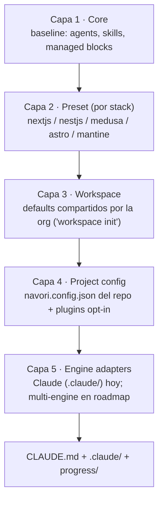
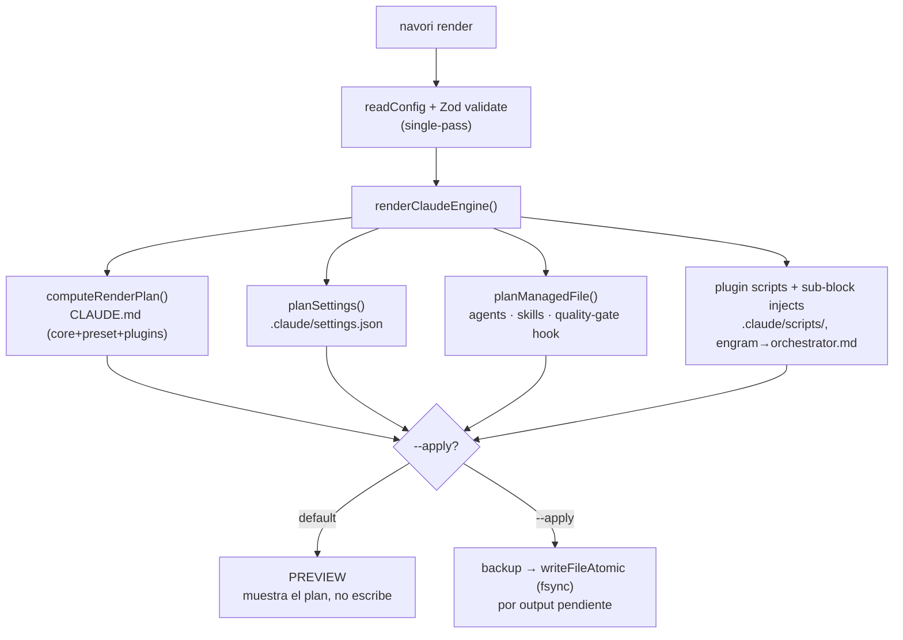
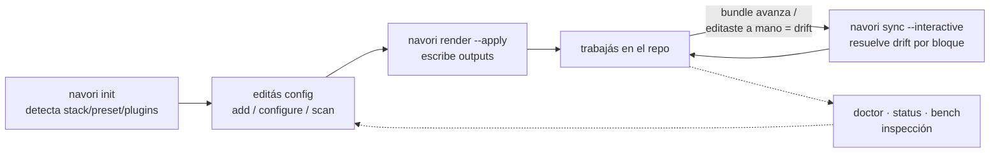

# Arquitectura de navori — cómo funciona (v0.2)

> Diagramas navegables: en GitHub, **hacé click en los nodos** para saltar al
> archivo fuente. navori reconstruye `CLAUDE.md` + `.claude/` de forma
> idempotente desde una única fuente de verdad (`navori.config.json`), sin
> pisar tu trabajo manual.

## 1. Modelo de capas — de dónde sale el contenido

Las 5 capas en cascada (decisión de diseño del proyecto): cada una compone
sobre la anterior. `navori.config.json` es la fuente de verdad checked-in y
materializa la **capa 4 (Project config)**: declara qué preset usar, de qué
workspace heredar y qué **plugins** habilitar. Los plugins son addons opt-in
*dentro* del Project config — no una capa aparte. La capa 5 (Engine adapters)
renderiza todo; hoy solo Claude Code, aunque el core es engine-agnostic por
diseño. (En monorepos, `monorepo.workspaces[]` aplica un override por app
dentro de la capa Project.)


```mermaid
flowchart TD
    CORE["Capa 1 · Core<br/>baseline: agents, skills, managed blocks"]
    PRESET["Capa 2 · Preset (por stack)<br/>nextjs / nestjs / medusa / astro / mantine"]
    WS["Capa 3 · Workspace<br/>defaults compartidos por la org ('workspace init')"]
    PROJ["Capa 4 · Project config<br/>navori.config.json del repo + plugins opt-in"]
    ENGINE["Capa 5 · Engine adapters<br/>Claude (.claude/) hoy; multi-engine en roadmap"]
    OUT["CLAUDE.md + .claude/ + progress/"]

    CORE --> PRESET --> WS --> PROJ --> ENGINE --> OUT

    click CORE "../packages/core/core-assets" "Core assets"
    click PRESET "../packages/core/core-assets/presets" "Presets"
    click WS "../packages/cli/src/lib/workspace/workspace.ts" "Workspace defaults"
    click PROJ "../packages/cli/src/lib/config/schema.ts" "Config schema (Zod)"
    click ENGINE "../packages/cli/src/engines/claude/index.ts" "Claude engine"
```

> Los **plugins** (engram / gh / jscpd / semgrep / acli / cognitive) se declaran
> en la capa Project config y el render los aplica junto a core + preset — ver
> el pipeline abajo. [packages/plugins/](../packages/plugins)

### Harness de workspaces en monorepos (`monorepo.workspaceHarness`)

`monorepo.workspaceHarness` (`lib/config/schema.ts`) decide cuánto harness escribe
navori en cada workspace. Es un único valor para todo el monorepo:

| Valor | Qué recibe el workspace |
|---|---|
| `minimal` (default) | Su archivo de contexto más las skills que la raíz no tiene ya. Una skill del workspace idéntica a la de la raíz (comparación normalizada, sin deriva de frontmatter) no se duplica. |
| `full` | Todo, como antes de recortar. Vuelve al comportamiento previo byte a byte. |
| `root` | Solo su archivo de contexto (`CLAUDE.md`, y `AGENTS.md` bajo Codex). La raíz escribe además las skills de librería y de preset que declaran los workspaces. |

`root` es para equipos que siempre abren la sesión en la raíz del repo. La decisión
(`engines/shared/workspace-engine-decision.ts`) se toma una sola vez antes de escribir y
la comparten `render`, `sync` y `doctor`, así que preview, apply y diagnóstico parten del
mismo plan. `sync` no borra: solo `render` poda. Lo que el recorte borra queda
respaldado (`navori backup`).

`navori doctor` y el diagnóstico de harness obsoleto (`lib/diagnose/stale-harness.ts`)
tratan `minimal` y `root` como harness recortado: no reportan como faltante lo que el
modo omite y sí reportan restos generados por navori que el modo ya no escribe. Bajo
`full`, `doctor` agrega una nota informativa: hooks, agentes, settings y `.mcp.json` del
workspace no se usan si la sesión arranca en la raíz; no cambia el veredicto de salud.

Advertencias operativas al usar `root`:

- **Actualizá navori antes de ponerlo.** Un navori anterior rechaza `"root"` y con él todo
  el config (el enum es estricto a propósito: un fallback silencioso a `minimal` recrearía
  skills en cada workspace). Actualizá a todo el equipo, a CI y al CLI global que usan los
  agentes antes de editar el config.
- **Directorios `<slug>-<id>` huérfanos en la raíz.** Si renombrás o quitás un workspace,
  los directorios `<slug>-<id>` que la raíz escribió para él no se detectan ni se borran:
  la poda parte del config actual y no escanea directorios. Borralos a mano.

## 2. Pipeline de render — `navori render [--apply]`

`render` es **preview por default** (no toca disco); `--apply` escribe. La
escritura es atómica y con backup previo. `NAVORI_BENCH=1` instrumenta los
tiempos por step.


```mermaid
flowchart TD
    CMD["navori render"]
    READ["readConfig + Zod validate<br/>(single-pass)"]
    ENG["renderClaudeEngine()"]
    P1["computeRenderPlan()<br/>CLAUDE.md (core+preset+plugins)"]
    P2["planSettings()<br/>.claude/settings.json"]
    P3["planManagedFile()<br/>agents · skills · quality-gate hook"]
    P4["plugin scripts + sub-block injects<br/>.claude/scripts/, engram→orchestrator.md"]
    GATE{"--apply?"}
    PREVIEW["PREVIEW<br/>muestra el plan, no escribe"]
    WRITE["backup → writeFileAtomic (fsync)<br/>por output pendiente"]

    CMD --> READ --> ENG
    ENG --> P1
    ENG --> P2
    ENG --> P3
    ENG --> P4
    P1 --> GATE
    P2 --> GATE
    P3 --> GATE
    P4 --> GATE
    GATE -- "default" --> PREVIEW
    GATE -- "--apply" --> WRITE

    click CMD "../packages/cli/src/commands/render.ts" "render command"
    click READ "../packages/cli/src/lib/config/config.ts" "readConfig"
    click ENG "../packages/cli/src/engines/claude/index.ts" "Claude engine"
    click P1 "../packages/cli/src/lib/render/render-plan.ts" "computeRenderPlan"
    click P2 "../packages/cli/src/engines/claude/build-settings.ts" "buildClaudeSettings"
    click P3 "../packages/cli/src/engines/shared/render-managed-file.ts" "renderManagedFile"
    click WRITE "../packages/cli/src/lib/primitives/atomic.ts" "writeFileAtomic"
```

## 3. Lifecycle de comandos — cómo lo usás


```mermaid
flowchart LR
    INIT["navori init<br/>detecta stack/preset/plugins"]
    EDIT["editás config<br/>add / configure / scan"]
    RENDER["navori render --apply<br/>escribe outputs"]
    WORK["trabajás en el repo"]
    SYNC["navori sync --interactive<br/>resuelve drift por bloque"]
    INSPECT["doctor · status · bench<br/>inspección"]

    INIT --> EDIT --> RENDER --> WORK
    WORK -- "bundle avanza /<br/>editaste a mano = drift" --> SYNC
    SYNC --> WORK
    WORK -.-> INSPECT
    INSPECT -.-> EDIT

    click INIT "../packages/cli/src/commands/init.ts" "init"
    click EDIT "../packages/cli/src/commands/add.ts" "add / configure"
    click RENDER "../packages/cli/src/commands/render.ts" "render"
    click SYNC "../packages/cli/src/commands/sync.ts" "sync"
    click INSPECT "../packages/cli/src/commands/status.ts" "status / doctor / bench"
```

## 4. Plan maestro — etapas numeradas y fases

El plan maestro organiza el trabajo de un proyecto en etapas independientes, numeradas y con
slug, por ejemplo `01-mvp` y `02-pagos`. Cada etapa tiene su propio registro bajo
`specs/_master/`; el índice indica cuál está activa y las etapas cerradas quedan como registros de
solo lectura.

El flujo progresa por fases: `context` reúne el modo y los archivos de entrada; `transcribed`
produce el inventario del código y su digest; `mapped` genera y evalúa planes; `planned` registra
las decisiones; `questioned` consolida el `MASTER.md` y sus partes; `mastered` espera la orden para
empezar; y `executing` da inicio a las partes como specs. `navori master check` valida la fase
activa y `navori master advance` solo la mueve cuando cumple sus criterios.

Una etapa puede terminar normalmente con `navori master close` tras la ejecución. Desde `context`
hasta `questioned`, el usuario puede optar por `close --convert` para convertir el trabajo en una
sola spec; antes de `mastered`, `close --abandon` registra su abandono. El cierre conserva el
registro de la etapa y actualiza el estado del plan maestro.

El estado mutable —etapa activa, fase, modo y estado o vínculos de cada parte— vive en JSON
validable por esquema, para que el CLI pueda comprobar transiciones y generar el estado derivado.
Los planes, las decisiones y el contenido del `MASTER.md` son prosa authored en Markdown: expresan
criterio humano y se validan contra su estructura, no se parsean como fuente de estado. Los archivos
de estado derivados, como `STATUS.md`, se renderizan.

## 5. El corazón: bloques managed

Todo el modelo gira alrededor de marcadores en los archivos generados. La
regeneración es idempotente y nunca pisa lo que está fuera de los markers.

```text
<!-- navori:managed id="idioma-rol" hash="a1b2c3" version="0.0.1" source="@navori/core" -->
## Idioma y rol
- Código inglés. Chat español MX.            <- zona MANAGED (navori la regenera)
<!-- /navori:managed id="idioma-rol" -->

## Mis notas del proyecto                      <- zona USUARIO (navori nunca toca)
- lo que escribas acá sobrevive a todo render
```

- **`hash`** → detecta edición manual del bloque (content drift). `sync` lo
  respeta o lo resuelve interactivo (keep-mine / accept-new).
- **`version`** → detecta que el bundle (core/preset/plugin) avanzó (version
  drift). `render --apply` lo actualiza.
- **Fuera de los markers** → tuyo, intocable. Ese es el moat: regeneración
  idempotente sin destruir tu trabajo. Ver [marker.ts](../packages/cli/src/lib/render/marker.ts).

### Resolución de archivos completos en `sync`

Un archivo managed completo (agente, skill, hook, script de plugin, `AGENTS.md`…) editado a mano
es resoluble solo si conserva el marcador navori de su id. El engine adjunta entonces
`SkippedFile.resolution` (`absPath`, `basis`, `content`, `chmodExec?`), calculado únicamente tras
`user-modified-skipped` —después del anti-rollback, así que un `downgrade-skipped` nunca la lleva—
y solo para un destino regular que no sea symlink. No se adjunta a archivos sin marcador, skips de
sub-bloque o settings, ni en Pi; tampoco cuando el render forzado iguala al archivo o falla. La
presencia del campo es el único criterio de «resoluble» y ningún JSON de salida incluye el
contenido.

- **`sync --interactive`** (o la opción «resolver uno por uno», ofrecida si hay conflictos de
  bloque o de archivo resoluble) muestra el diff por archivo y pregunta keep/accept. Todas las
  respuestas se recogen antes de escribir; cancelar no escribe nada.
- **Escritura**: los aceptados se escriben con `commitWrites` y backup `<target>:sync` antes del
  apply normal. Justo antes de cada escritura se re-verifica que el archivo siga siendo regular e
  igual al `basis` mostrado (TOCTOU); si no, se descarta con aviso y los demás continúan. Si una
  escritura falla, los anteriores quedan escritos (con sus backups impresos), los posteriores no se
  intentan, sale con exit 1 y repetir el comando es idempotente.
- **`--accept-new-files`** acepta todo archivo resoluble sin preguntar. Solo escribe con `--apply`
  o `--yes` (si no, preview); combina con `--accept-new`, y se rechaza con `--keep-mine`
  (`bulk-flags-conflict`) e `--interactive` (`bulk-flags-interactive`). `--yes` sigue saliendo con
  1 si quedan conflictos de bloque de CLAUDE.md sin responder; `--accept-new` solo nunca toca
  archivos completos (semántica CI intacta, #523).
- **`sync --json`** añade `acceptNewFiles` y, por conflicto, `resolvable` (`bulk` | `none`), nunca
  `basis` ni contenido. Reporta el estado posterior a resolver: los archivos resueltos salen de
  `conflicts[]` y `targets[].skipped`, y entran en `written`/`backups`.
- **Sin marcador** sigue la salida manual: mover el archivo aparte y `navori render --apply`
  (seguimiento en #1245).

Ver [sync.ts](../packages/cli/src/commands/sync.ts) y
[execute-plan.ts](../packages/cli/src/engines/shared/execute-plan.ts).

## 6. Modos de permiso de Claude Code — tabla de referencia

Referencia de lookup (no una orden always-on): el bloque managed
`operaciones-seguras` solo enlaza aquí. El modo lo fija el host, no el agente.
Doc oficial: https://code.claude.com/docs/en/permission-modes

| Mode | Runs without asking | What it changes for you |
|---|---|---|
| `default` | reads only | every edit and every command prompts: batch them and explain before asking |
| `acceptEdits` | reads, edits, common FS commands | edit freely; the shell still prompts outside the read-only set |
| `plan` | reads, plus classifier-approved commands | **you do not write**: the architectural pass, `auditor` and an SDD spec ARE this mode's work; leave the mode to execute |
| `auto` | everything, classifier-reviewed | every shell command pays a classifier round-trip; reads, in-workspace edits and `allow`-covered MCP calls don't, so `cmd1 && cmd2` in one call beats two |
| `dontAsk` | only what is pre-approved | `Edit`/`Write` are NOT in navori's `allow` and the mode denies `AskUserQuestion` outright: the implement/review cycle cannot run. The one mode navori does not support today — use `default`, `acceptEdits`, `plan` or `auto` |
| `bypassPermissions` | everything | prompts are skipped and `allow` rules stop having any effect — but `deny` rules still block, in this mode as in every other, and so does the hook (`exit 2` blocks in any mode). Isolated environments only |

### 6.1 Bloqueos de hooks — clasificación hard / ask / advisory

Cada script managed con `exit 2` declara su clasificación en el header
`# Blocking classification (#1117):` (lo exige `hook-claims-vs-scripts.test.ts`).

| Clase | Significa | Hooks |
|---|---|---|
| `hard` | hay veredicto o una contención: no hay nada que aprobar | `guard-destructive` (límites, `--no-verify`, force-push a base, `rm` sobre root/home/sistema, reescritura de archivos managed), `plan-gate` con plan denegado, `quality-gate-pre-commit` con cwd inválido o gate en rojo, `role-guard`, `implementer-no-markdown`, `subagent-no-background`, `engram-write-guard`, `check-jscpd`/`check-semgrep` con hallazgos |
| `ask` | no hay veredicto (falta la herramienta): decide el humano en la UI | `plan-gate` con `navori` ausente o sin subcomando `plan`; `quality-gate-pre-commit` con runner ausente; `check-jscpd` sin flags, ambiguo o con corrida fallida |
| `advisory` | `PostToolUse`: el `exit 2` solo llega al modelo | `managed-drift-watch` |

`ask` solo se emite si `navori_can_ask` ([gate-ask.sh](../packages/core/core-assets/hooks/_partials/gate-ask.sh))
lo permite: script no-Codex, `jq`, payload `PreToolUse` y `permission_mode` en
`default`, `acceptEdits` o `auto`. `plan` queda fuera (puede correr con prompts
desactivados); vacío, ausente o desconocido también. Fuera de la allowlist el gate
bloquea con `exit 2`, así que un `ask` nunca se vuelve un allow silencioso. Codex ignora
`permissionDecision`: ahí es siempre `exit 2`. Los hooks de confirmación (`master-accept`,
`comment-draft`, etc.) conservan su `ask` en todo modo: su respaldo es permitir.

Contrato del host para un `ask` de hook (docs de Claude Code):

| Modo | `ask` de hook | `exit 2` | Regla `ask` de settings |
|---|---|---|---|
| `default`, `acceptEdits`, `plan` | pregunta | bloquea | pregunta |
| `auto` | fuerza el prompt | bloquea | pregunta |
| `dontAsk` | se niega solo | bloquea | se niega |
| `bypassPermissions` | no documentado | bloquea | pregunta |
| `-p` | se niega | bloquea | se niega salvo host de permisos |

`guard-destructive` no pregunta. Para `rm` sobre una variable bloquea y su mensaje
indica la forma literal `rm -rf <ruta absoluta>`, que la regla `ask` de
`settings-base.json` convierte en confirmación nativa. Residual: esa regla solo
casa las grafías literales; cualquier otra forma sigue bloqueada.

Auditoría: `navori_audit_log` deriva `kind` del veredicto (`block` → `hard`,
`ask` → `ask`; `deny` explícito) y `reason` es un único código de la allowlist
`HOOK_REASON_CODES` ([model.ts](../packages/cli/src/lib/audit/model.ts)), espejo de la lista
de `jq` del partial (un test detecta deriva). Cualquier otro texto se registra como
`unspecified`.

## Archivos clave

| Pieza | Archivo |
|---|---|
| Config + schema (Zod) | [lib/config/schema.ts](../packages/cli/src/lib/config/schema.ts) · [lib/config/config.ts](../packages/cli/src/lib/config/config.ts) |
| Plan de render (CLAUDE.md) | [lib/render-plan.ts](../packages/cli/src/lib/render/render-plan.ts) |
| Markers managed (inject/diff/hash) | [lib/marker.ts](../packages/cli/src/lib/render/marker.ts) |
| Engine Claude | [engines/claude/index.ts](../packages/cli/src/engines/claude/index.ts) |
| Settings deep-merge | [engines/claude/build-settings.ts](../packages/cli/src/engines/claude/build-settings.ts) |
| Render de agents/skills/hooks | [engines/shared/render-managed-file.ts](../packages/cli/src/engines/shared/render-managed-file.ts) |
| Presets / Plugins | [lib/presets.ts](../packages/cli/src/lib/config/presets.ts) · [lib/plugins.ts](../packages/cli/src/lib/config/plugins.ts) |
| Health-check (doctor/status) | [lib/diagnose/health.ts](../packages/cli/src/lib/diagnose/health.ts) |
| Detección de stack | [lib/diagnose/detect.ts](../packages/cli/src/lib/diagnose/detect.ts) |
| Comandos | [src/commands/](../packages/cli/src/commands) |
| Assets bundleados | [core-assets/](../packages/core/core-assets) · [plugins/](../packages/plugins) |

> El plan de release que produjo v0.2 está en
> [specs/0003-v0.2-quality-velocity-tokens/design.md](../specs/0003-v0.2-quality-velocity-tokens/design.md).
